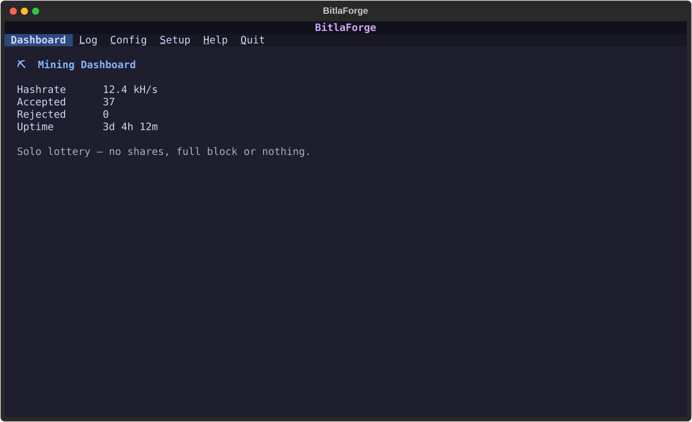
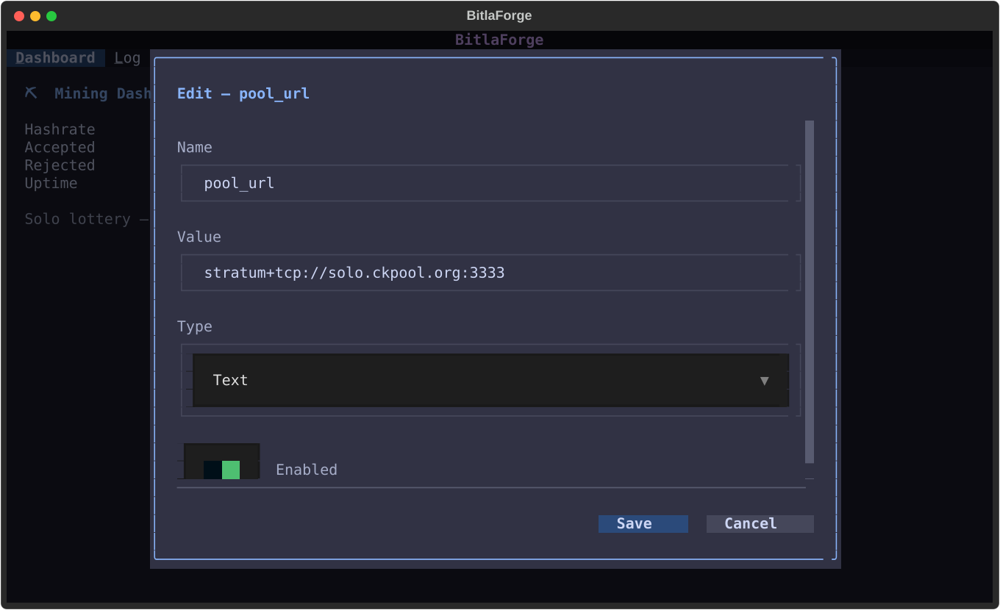
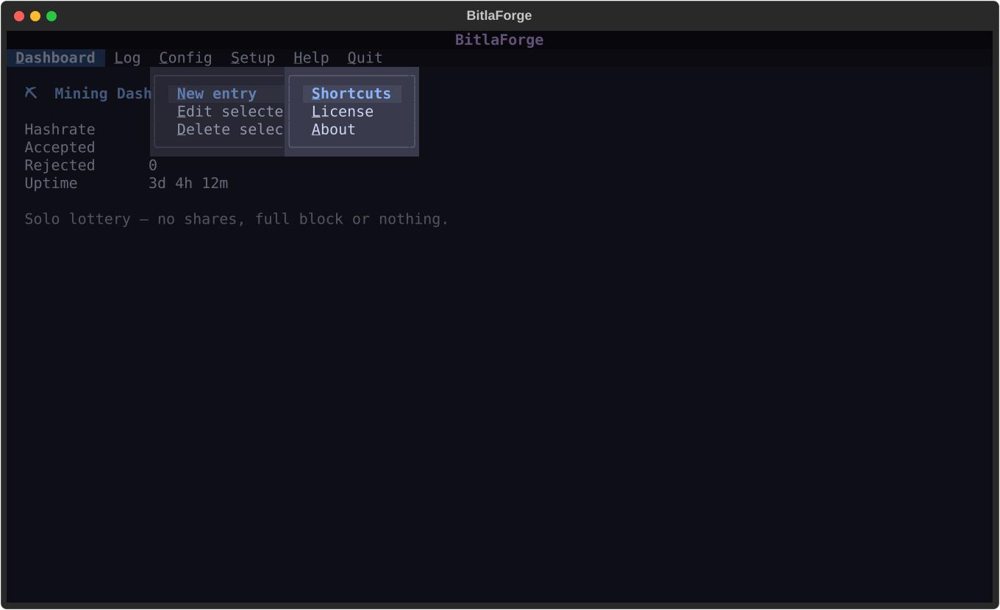
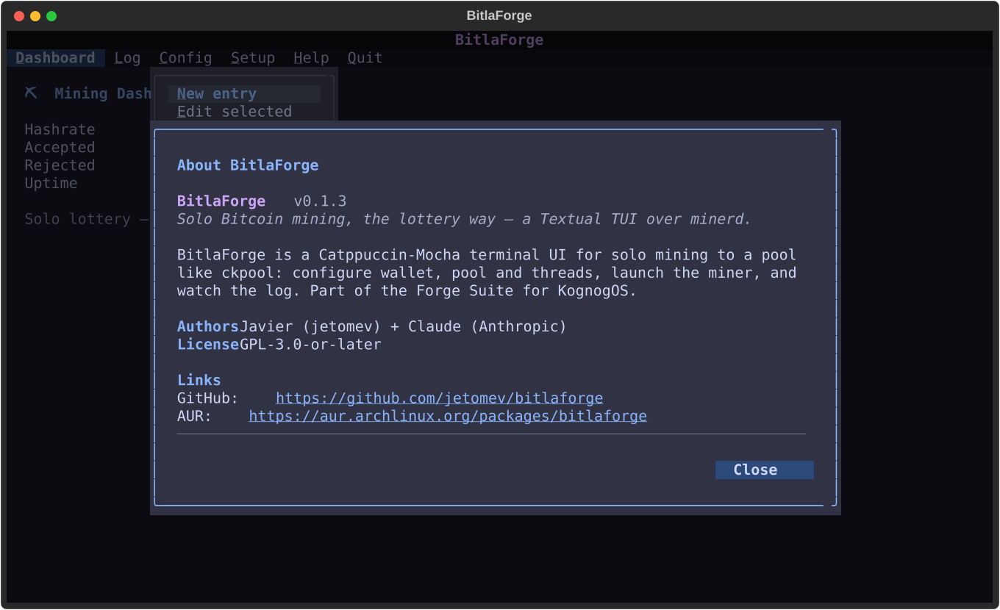

# 🔨 forgekit


> 🛡 **Security:** every release is GPG-signed and every commit GitHub-Verified. Read **[Where We Stand](https://github.com/jetomev/KognogOS/blob/main/docs/where-we-stand.md)** — our response to the 2026 AUR supply-chain attacks, what is current, and how to verify us instead of trusting us.

A shared **Textual TUI shell** for the [Forge Suite](#the-forge-suite): a classic
**top menu bar**, a **full-width workspace**, and **floating dialogs** — Catppuccin-Mocha
themed. Build a terminal app by subclassing one class and declaring your menu,
sections, and actions.

```
┌───────────────────────────── BitlaForge ─────────────────────────────┐   title bar
│ Dashboard  Log  Config  Setup  Help  Quit                            │   menu bar
│                                                                       │
│   … the active section owns the whole width …                        │   workspace
│                                                                       │
└───────────────────────────────────────────────────────────────────────┘
```

- **Menu bar** — main options with the first letter underlined (`Ctrl+<letter>`),
  always ordered `…app options…  Help  Quit`. Submenus drop down with a per-item
  underlined letter to select.
- **Workspace** — one full-width section at a time (no fixed sidebar), swapped
  from the menu bar.
- **Floating dialogs** — editors and confirmations float over the workspace
  instead of splitting it; a confirm can stack on top of an editor. Panels scale
  with the terminal and their buttons scroll with the content.
- **Help windows** — `Shortcuts`, `License`, and `About` come built in.
- **Toasts** stay for quick, transient messages.

> **Status: 0.3.0 (alpha).** The API may shift as the Forge Suite apps migrate
> onto it. Pin a version if you depend on it.

## Screenshots

*(Generated from `examples/demo.py` — `PYTHONPATH=. python docs/screenshots/generate.py` re-renders the gallery each release.)*

**The shell** — title + menu bar, sections, Catppuccin Mocha


**Floating edit dialog** (`ForgeModal` + `.forge-panel` + fixed footer)


**Menu dropdown**


**About window** (`ForgePanelScreen`)


## Install

On Arch, from the AUR — this is the packaged path the Forge apps depend on,
and it verifies the release signature at build time:

```bash
yay -S python-forgekit
```

Anywhere else, or for development:

```bash
pip install git+https://github.com/jetomev/forgekit
# or, for local development:
git clone https://github.com/jetomev/forgekit && cd forgekit
pip install -e .
python examples/demo.py
```

Requires Python 3.10+ and `textual>=8.0`.

## Quickstart

```python
from textual.binding import Binding
from forgekit import ForgeApp, FORGE_CSS, GPL3_NOTICE
from textual.widgets import Static
from textual.containers import Vertical

class MyApp(ForgeApp):
    APP_NAME = "MyForge"
    CSS = FORGE_CSS
    MENU = [
        {"id": "home", "title": "Home", "kind": "section"},
        {"id": "help", "title": "Help", "kind": "menu", "items": [
            ("Shortcuts", "s", "shortcuts"),
            ("License",   "l", "license"),
            ("About",     "a", "about"),
        ]},
        {"id": "quit", "title": "Quit", "kind": "action", "action": "quit"},
    ]
    SHORTCUTS = [("Ctrl+G", "Home"), ("Ctrl+H", "Help"), ("Ctrl+Q", "Quit")]
    ABOUT = {"name": "MyForge", "version": "0.1.0", "description": "…",
             "license": "GPL-3.0-or-later", "links": [("GitHub", "https://…")]}
    LICENSE_NOTICE = GPL3_NOTICE
    BINDINGS = [Binding("ctrl+g", "activate('home')", show=False, priority=True)]

    def compose_sections(self):
        with Vertical(id="sec-home"):
            yield Static("Hello from the workspace.")

    def on_action(self, action_id):
        ...  # handle your own submenu actions here

if __name__ == "__main__":
    MyApp().run()
```

See [`examples/demo.py`](examples/demo.py) for the full pattern — a `Config`
section with a floating edit dialog and a stacked delete-confirm.

## The objects

| Object | What it is |
| --- | --- |
| `ForgeApp` | Base app: title + menu bar, the section switcher, menu dispatch, and the Help windows. Subclass it. |
| `MenuBar` / `MenuDropdown` | The top bar and its dropdown submenus. |
| `ConfirmDialog` | Small yes/no; stacks over anything; returns a bool. |
| `ForgePanelScreen` | The standard scrolling panel (title + body + trailing Close). Base for info windows. |
| `AboutDialog` / `LicenseDialog` / `ShortcutsDialog` | The Help windows. |
| `FORGE_CSS` / `COLORS` / `GPL3_NOTICE` | The base stylesheet, the Catppuccin palette, and a ready GPL notice. |

### Menu model

```python
{"id": "config", "title": "Config", "kind": "menu", "items": [
    ("New entry", "n", "add"),          # (label, in-menu accelerator, action id)
]}
# kind:  "section" → switch the workspace · "menu" → dropdown · "action" → run
```

## Keyboard model

Main options use their **first letter** as `Ctrl+<letter>`; the app's shortcuts
take priority over the terminal's. One sharp edge to know: a few control keys
are terminal conventions — `Ctrl+C` (interrupt), `Ctrl+S`/`Ctrl+Q` (flow
control), and `Ctrl+H` (often Backspace). `forgekit` binds them with priority so
the app wins where the terminal allows, but if a section's first letter is one
of those and your terminal swallows it, underline a different letter for that
option.

## The Forge Suite

`forgekit` is the shared UI layer being adopted (v2.0) across the Forge Suite
for KognogOS — grubForge, alacrittyForge, BitlaForge, nogForge, and the two
distro-critical apps decided 2026-07-31 under KognogOS's **TUI-first
doctrine**: **welcomeforge** (the KognogOS Welcome Center — forgekit's pilot
adopter) and **installforge** (the OS installer, building on the kit
welcomeforge matures). Splitting the shell into one library means a fix or a
polish lands for every app at once — and the suite is deliberately growing
toward a full **Forge Control Center** for the OS.

## License & credits

GPL-3.0-or-later — see [`LICENSE`](LICENSE).

A human + AI collaboration: **Javier** ([@jetomev](https://github.com/jetomev)) with
**Claude** (Anthropic) as co-developer.
