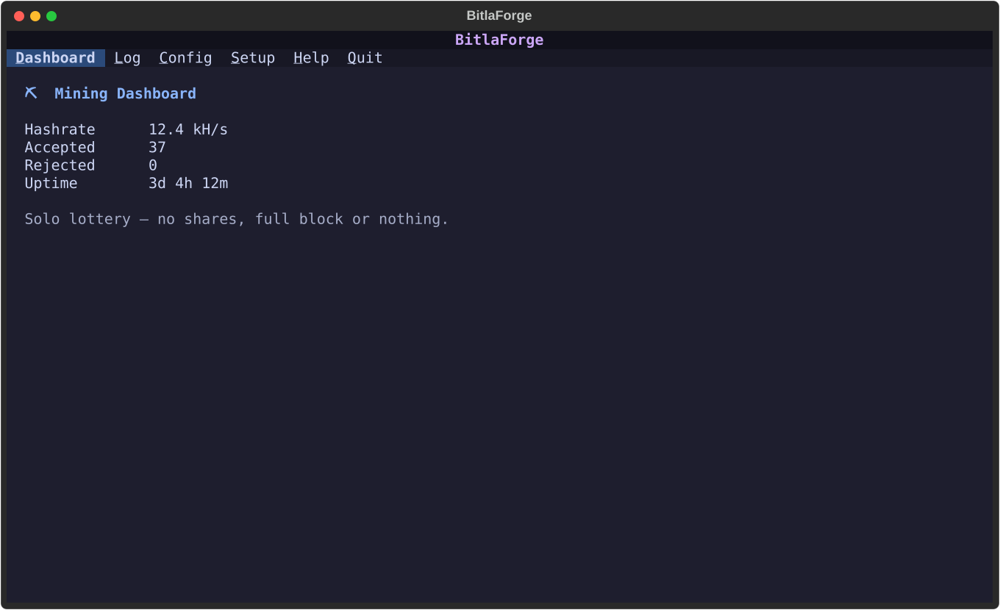
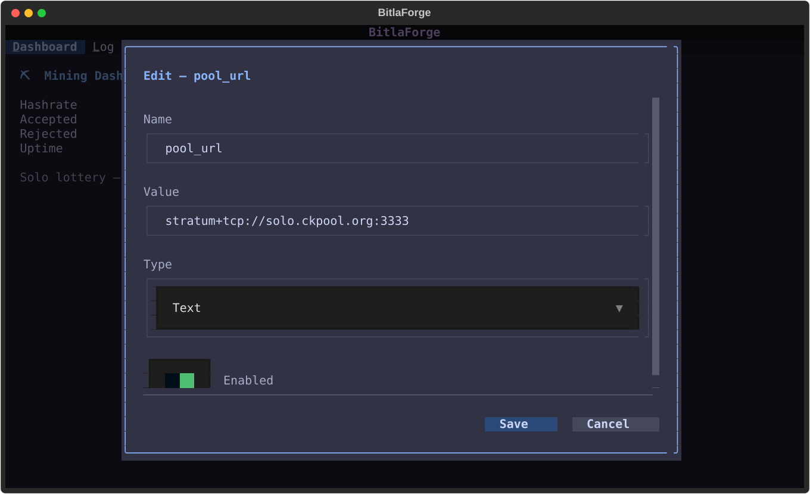
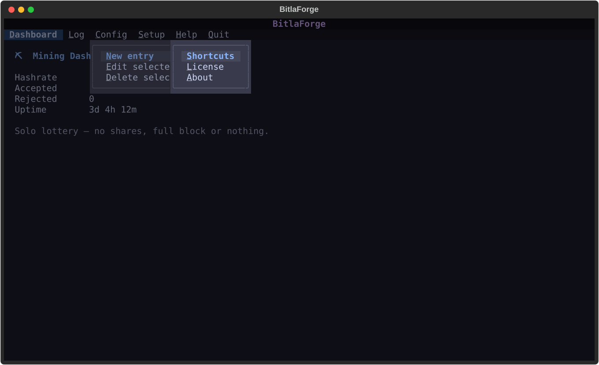
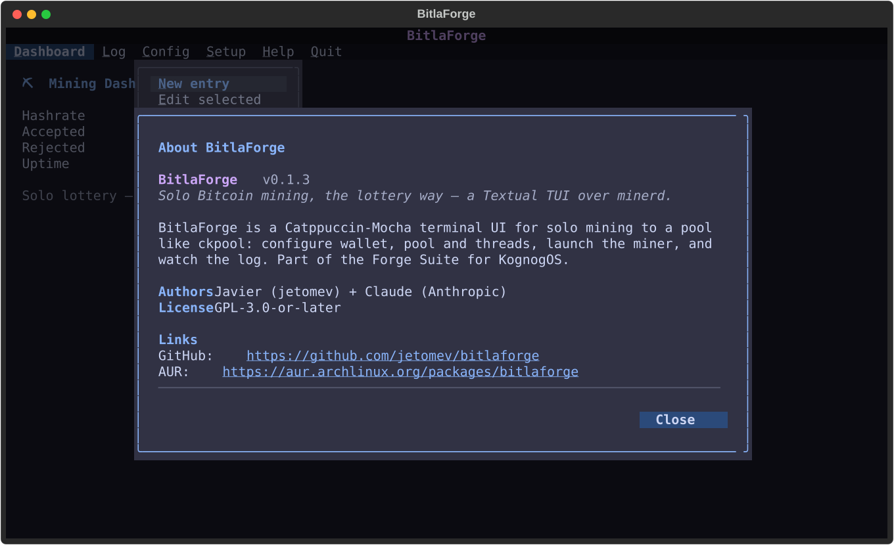

> ## 📦 forgekit has moved into the [Forge Suite](https://github.com/jetomev/forge-suite/tree/main/forgekit)
> Since **6 October 2026** forgekit lives in **[jetomev/forge-suite](https://github.com/jetomev/forge-suite)**, with its full history. New releases are tagged `forgekit-vX.Y.Z` there, and issues go there too. This repository is archived: its releases (up to 0.6.0) and issues stay readable, and the AUR package `python-forgekit` keeps working.

# 🔨 forgekit


> 🛡 **Security** — every release is GPG-signed and every commit is GitHub-Verified. **[Where We Stand](https://github.com/jetomev/KognogOS/blob/main/docs/where-we-stand.md)** covers our response to the 2026 AUR supply-chain attacks and how to check us yourself.

**A shared foundation for building terminal apps that look and behave the same.**

Every app in the [Forge Suite](#the-forge-suite) runs in a terminal, but they're
real applications — menus you click or type through, dialogs that float over your
work, keyboard shortcuts, a consistent look. forgekit is the part they all share.

Without it, every app would rebuild its own menu bar and its own dialogs, and they'd
drift apart. With it, you write only what makes your app different, and a fix or a
polish improves every app at once.

```
┌───────────────────────────── bitlaForge ─────────────────────────────┐   title bar
│ Dashboard  Log  Config  Setup  Help  Quit                            │   menu bar
│                                                                       │
│   … the active section owns the whole width …                        │   workspace
│                                                                       │
└───────────────────────────────────────────────────────────────────────┘
```

**What you get:**

- **A menu bar** across the top. Each option's first letter is underlined and works
  as `Ctrl+<letter>`. Options always end with `Help` and `Quit`, in that order.
- **A workspace** showing one full-width section at a time. No permanent sidebar
  eating your screen — you switch sections from the menu.
- **Floating dialogs** that sit over your work rather than splitting the screen.
  They can stack: a confirmation can open on top of an editor. They resize with
  the terminal.
- **Help windows** — `Shortcuts`, `License` and `About` are built in and work
  from the start.
- **Toasts** for quick messages that don't need a dialog.
- **A tool's run inside the app** *(0.6.0)*. Hand a real program (a package manager,
  a helper) to a window over your app: its steps and a progress bar, its own screen
  when it asks something, Yes/No for its questions. The app never leaves its screen.
- **The password inside the app** *(0.6.0)*. sudo's and polkit's password questions are
  asked in the app's own box, on a desktop and on a text console alike.
- **A text-console mode.** On the plain Linux text screen (`Ctrl+Alt+F3`) every app
  switches to colours and characters that screen can actually show, by itself.
  [More below](#on-a-plain-text-console).

> **Status: 0.6.0 (alpha).** The API may still shift while the Forge apps migrate
> onto it. Pin a version if you depend on it.
> 0.6.0: a tool's run and its password inside the app: `RunWindow`, `TerminalPane`,
> `PasswordBridge`, `InAppPolkitAgent` ([#6](https://github.com/jetomev/forgekit/issues/6)).
> Javier, about nogForge leaving its screen for nog: *"it is not beautiful, it is
> disrupting."* nogForge 1.1 and grubForge 2.1 are built on it.
> 0.5.2: the bottom bar shows the keys of the screen you're on, found by Javier in
> [nogForge](https://github.com/jetomev/nogforge). Earlier versions: [docs/CHANGELOG.md](docs/CHANGELOG.md).

## Screenshots

*Generated from `examples/demo.py` and `examples/gallery.py`. Run `PYTHONPATH=. python docs/screenshots/generate.py` to re-render them.*

**The shell** — title bar, menu bar, and a section


**A floating edit dialog**


**A menu dropdown**


**The About window**


**A settings form** (0.5.0), from `examples/gallery.py`: a changed setting, presets, worded switches, the changes bar and the hint line


## Install

On Arch, from the AUR. This is the packaged path the Forge apps depend on, and it
verifies our release signature while building:

```bash
yay -S python-forgekit
```

Anywhere else:

```bash
pip install git+https://github.com/jetomev/forgekit
```

For development:

```bash
git clone https://github.com/jetomev/forgekit && cd forgekit
pip install -e .
python examples/demo.py
```

Requires Python 3.10 or newer, `textual>=8.0`, and `pyte` (0.6.0: it draws a program's
screen inside the app). `InAppPolkitAgent` also needs PyGObject with polkit's libraries
(`python-gobject`, `polkit`); without them it says so and the app keeps the desktop's way.

## Quickstart

A complete app. Subclass one class, declare your menu, and write your sections.

```python
from textual.binding import Binding
from forgekit import ForgeApp, FORGE_CSS, GPL3_NOTICE
from textual.widgets import Static
from textual.containers import Vertical

class MyApp(ForgeApp):
    APP_NAME = "MyForge"
    CSS = FORGE_CSS
    MENU = [
        {"id": "home", "title": "Home", "kind": "section"},
        {"id": "help", "title": "Help", "kind": "menu", "items": [
            ("Shortcuts", "s", "shortcuts"),
            ("License",   "l", "license"),
            ("About",     "a", "about"),
        ]},
        {"id": "quit", "title": "Quit", "kind": "action", "action": "quit"},
    ]
    SHORTCUTS = [("Ctrl+G", "Home"), ("Ctrl+H", "Help"), ("Ctrl+Q", "Quit")]
    ABOUT = {"name": "MyForge", "version": "0.1.0", "description": "…",
             "license": "GPL-3.0-or-later", "links": [("GitHub", "https://…")]}
    LICENSE_NOTICE = GPL3_NOTICE
    BINDINGS = [Binding("ctrl+g", "activate('home')", show=False, priority=True)]

    def compose_sections(self):
        with Vertical(id="sec-home"):
            yield Static("Hello from the workspace.")

    def on_action(self, action_id):
        ...  # handle your own menu actions here

if __name__ == "__main__":
    MyApp().run()
```

[`examples/demo.py`](examples/demo.py) shows the full pattern, including a Config
section with a floating editor and a delete confirmation stacked on top of it.

## What's in the box

| Object | What it is |
| --- | --- |
| `ForgeApp` | The base app — title bar, menu bar, section switching, and the Help windows. Subclass this. |
| `MenuBar` / `MenuDropdown` | The top bar and its dropdowns. |
| `ConfirmDialog` | A small yes/no. Stacks over anything and returns a boolean. |
| `ForgePanelScreen` | The standard scrolling panel — title, body, and a Close button. Use it for any information window. |
| `AboutDialog` / `LicenseDialog` / `ShortcutsDialog` | The built-in Help windows. |
| `FORGE_CSS` / `COLORS` / `GPL3_NOTICE` | The stylesheet, the Catppuccin palette, and a ready-made GPL notice. |
| `ROLES` / `css_variables()` | The colour roles (`$forge-accent`, `$forge-muted`, `$forge-border`…): one colour for a terminal window, one for a text console. Use the same names in your own CSS. |
| `glyph()` / `GLYPHS` | Named marks (`ok`, `warn`, `error`, `busy`…) that turn into console-safe ones on a text console: `✓` → `+`, `⚠` → `!`. |
| `console_mode()` / `console_text()` | Whether the app runs on a text console, and the character swap it applies. Your app reads `self.forge_console`. |

### A tool's run and its password (0.6.0)

For apps that hand work to a real program and must not leave their screen while it runs
(nogForge with nog, grubForge with polkit). Proven on a real text console.

| Object | What it is |
| --- | --- |
| `ForgeApp.run_in_app()` / `RunWindow` | Run a program in a window over the app. Steps and a progress bar from a JSON-lines events file; the program's own screen folded until it asks something or fails (F12 anytime); **Yes (y) / No (n)** for yes/no questions; menus (yay's `==>`) are typed in the screen; an editor or pager simply gets the keys. Returns the exit status. |
| `TerminalPane` | A program in a pseudo-terminal, drawn inside the app (pyte, plus the alternate screen and a capped scrollback). Keys and Ctrl+C go to it. |
| `PasswordBridge` / `PasswordDialog` | `sudo -A`'s helper asks the running app over a private socket (a folder only you can open, a one-time token); the app shows its password box; "try again" after a wrong one. Nothing is written to disk or put on a command line. |
| `ForgeApp.polkit_agent()` / `InAppPolkitAgent` | The app becomes polkit's password asker **for its own process only**: `pkexec` asks in the app's box, and polkit's own helper checks the password. Three tries; Cancel cancels. |

### Forms and flows (0.5.0)

Everything a settings screen needs, so known values are picked rather than typed, and every
change is seen before it is written. `examples/gallery.py` shows them all on one screen.

| Object | What it is |
| --- | --- |
| `SettingRow` | One setting: label, control, and a line under it with a hint, or "● changed · was: …" once changed (the mark always fits, at any width). `stacked=True` puts the control under the label. |
| `Toggle` / `Choices` / `CheckList` / `NumberPresets` | Worded On/Off switch · radio choices in one box · a ticklist (unticked boxes stay empty) · a number with one-key presets. |
| `FilterPicker` | A list you narrow by typing, optionally accepting your own value. |
| `ChangesBar` | The bar at the bottom: "3 changes not saved yet" with its buttons. |
| `HintBar` | The keys that work right now, from the focused widget's `FORGE_HINTS`. |
| `Notice` / `notice_markup()` | A designed message: a heading and indented lines that wrap under their own indent. |
| `ReviewDialog` / `ChangeGroup` / `review_markup()` | Every change as old → new, grouped, before anything is written. |
| `ProgressDialog` | Steps with their state and a live log, for saves that take a while. |
| `ManualScreen` / `load_pages()` | A manual inside the app, from Markdown pages; F1 can open the right page. |
| `session_banner()` / `closing_notice()` / `runs_log_row()` | The same start and end on every run: a banner, a closing note in the terminal, and one line per run in a log. |
| `ConfirmDialog(default_no=True)` | For risky steps: the window starts on Cancel. |

### How a menu is described

```python
{"id": "config", "title": "Config", "kind": "menu", "items": [
    ("New entry", "n", "add"),          # (label, letter to press, action id)
]}
```

Each entry has a `kind`:

- `"section"` — switch the workspace to that section
- `"menu"` — open a dropdown
- `"action"` — run something immediately

## Keyboard model

Menu options use their first letter as `Ctrl+<letter>`, and the app's shortcuts
take priority over the terminal's.

One sharp edge worth knowing: a few control keys are terminal conventions rather
than yours. `Ctrl+C` interrupts, `Ctrl+S` and `Ctrl+Q` are flow control, and
`Ctrl+H` is often Backspace. forgekit claims them with priority so your app wins
wherever the terminal allows it — but if a section's first letter is one of those
and your terminal insists on keeping it, underline a different letter for that
option instead.

**Help is also on `F1`** (since 0.4.0). A plain text console always sends `Ctrl+H` as
Backspace, so there `F1` is the way to Help, and the menu bar says so: on a console it
reads `Help F1` (since 0.4.1).

## On a plain text console

A text console is where you end up when the desktop is broken, which is exactly when
you want a bootloader manager or a package manager. So forgekit makes a promise:

> **Every Forge app is readable and usable on a plain text console (`TERM=linux`).**
> It does not have to look the same as in a terminal window.

That screen has only 16 colours (8 of them reliable as backgrounds) and a font of
about 256 characters: no rounded corners, no `✓`, no emoji. It also shows underlined
text in cyan and italic text in green. When an app starts there, forgekit switches,
by itself:

- **colours by role:** each role (`accent`, `muted`, `border`…) gets a console colour
  chosen so the roles stay apart;
- **characters:** every character the console font lacks is swapped for one it has,
  keeping the same width so columns stay lined up (`╭` → `┌`, `✓` → `+`, `Á` → `A`);
- **scrollbars** in whole cells, and **F1** for Help (shown in the menu bar);
- **focus you can see:** the focused button is blue with white text, a colour no other
  button uses, so Tab visibly moves (since 0.4.1; a console cannot show the tint a
  terminal uses).


*Before, 0.3.0: bars and work area all black, red boxes where the font has no character.*


*After, 0.4.0: the same app, same screen.*

In a terminal window nothing changed in 0.4.0: the four screenshots above regenerated
identical to 0.3.0. (0.5.0 then gave fields a plain single border, which the current
pictures show.)

**Override:** `FORGE_ASCII=1` forces console mode on (for terminals that claim more
than they can draw), `FORGE_ASCII=0` forces it off.

**Testing it:** `python tools/console-preview.py --out shot.png -- python examples/demo.py`
shows what an app looks like on a text console and fails on any character the
console cannot draw or any letter drawn in its own background colour. The 0.4.0
release was also checked on a real console in a KognogOS virtual machine
(`tools/vcsa-shot.py` redraws a real console's screen exactly).

## The Forge Suite

forgekit is the shared foundation for the Forge apps that ship with
[KognogOS](https://github.com/jetomev/KognogOS):

- **[grubForge](https://github.com/jetomev/grubforge)** — bootloader manager
- **[alacrittyForge](https://github.com/jetomev/alacrittyforge)** — terminal configurator
- **[bitlaForge](https://github.com/jetomev/bitlaforge)** — solo Bitcoin mining
- **[nogForge](https://github.com/jetomev/nogforge)** — package manager companion
- **welcomeforge** — the KognogOS Welcome Center, and forgekit's pilot app
- **installforge** — the KognogOS installer, built on the foundation welcomeforge matures

KognogOS decided in July 2026 that its system tools would be terminal apps rather
than graphical ones. That makes this library load-bearing: it's the reason the
installer and the welcome screen will feel like the same product as the tools you
use afterwards. The suite is growing toward a full **Forge Control Center** for
the whole OS.

## License & credits

GPL-3.0-or-later — see [`LICENSE`](LICENSE).

A human and AI collaboration: **Javier** ([@jetomev](https://github.com/jetomev))
with **Claude** (Anthropic) as co-developer.
